# 🛒 Dmart-Rice-Sales-Analysis-MySQL

## 📊 Project Overview
This project analyzes D-Mart rice brand sales data using MySQL. 15 business-oriented SQL queries were solved to extract insights such as
- Sales Performance
- Revenue Contribution
- Fake Discount Detection
- Top-Performing Products
- Location-Wise Trends
  
---

## 📌 General Topics
- #### *Database_Name - D_Mart_Rice_Brand*
- #### *Table_Name - Rice_Sales*
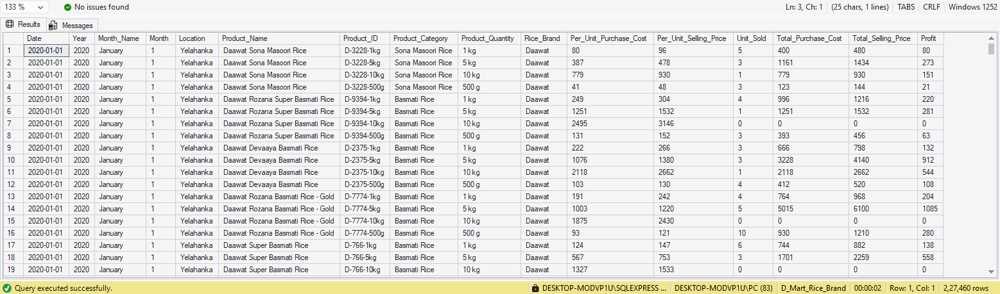

---
### <b> 📈 Q1. Year-wise Revenue and Profit Trend
#### *Write a query to calculate total sales revenue, total profit, and total units sold for each year.  Order the result by profit in descending order.*

```MySQL
select Year, 
SUM(Unit_Sold) as "Unit_Sold",
SUM(Total_Selling_Price) as "Total_Sales_Revenue",
SUM(Profit) as "Profit"
FROM Rice_Sales 
group by Year order by Profit desc;
```
## 📷 Output

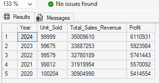

---

### <b> 📈 Q2. Top 5 Most Profitable Rice Brands
#### *Find the top 5 rice brands that generated the highest total profit across all years.*

```MySQL
select top 5 Rice_Brand,
sum(Profit) as "Total_Profit"
from Rice_Sales 
GROUP BY Rice_Brand order by Total_Profit desc;
```
## 📷 Output

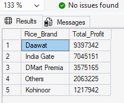

---

### <b> 📈 Q3. Location Performance Ranking
#### *Rank all store locations based on total selling price using RANK () or DENSE_RANK ().*

```MySQL
select Location, 
sum(Total_Selling_Price) as "Total_Selling_Price",
RANK() over (order by sum(Total_Selling_Price)desc) as "Location_Rank"
from Rice_Sales 
group by Location;
```
## 📷 Output

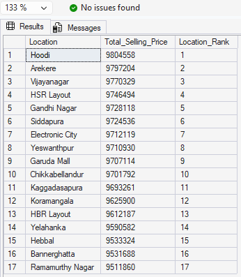

---

### <b> 📈 Q4. Month-wise Sales Growth Analysis
#### For each year, calculate:
-	Current month sales
-	Previous month sales
-	Percentage growth or decline using LAG () window function

```MySQL
with Month_Wise as (
select Year, Month, 
sum(Total_Selling_Price) as Current_Month
from Rice_Sales
group by Year, Month
),
Lag_Month_Wise as (
select Year, Month, Current_Month,
LAG(Current_Month) over (partition by Year order by Month) as Previous_Month
from Month_Wise
)
select Year, Month,
Current_Month, Previous_Month,
case
when Previous_Month IS NULL or Previous_Month = 0 then Null
Else
Cast((Current_Month - Previous_Month) * 100.0/Current_Month as decimal(10,2))
end
as Percentage_Growth
from Lag_Month_Wise
order by Year, Month;
```
## 📷 Output

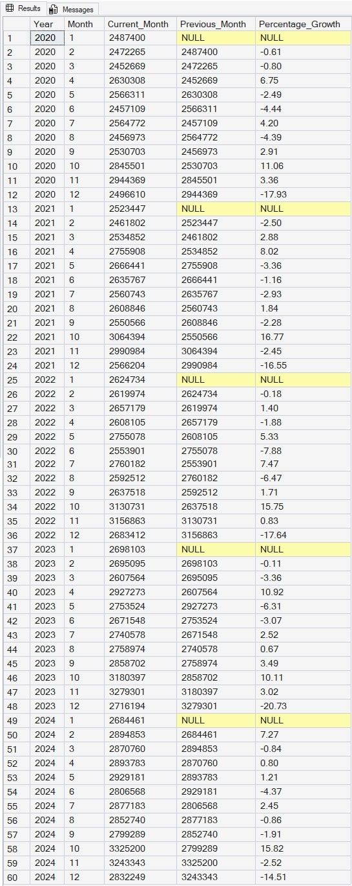

---

### <b> 📈 Q5. Product-Level Profit Margin Analysis
#### *Compute profit margin percentage for each product, Then display top 10 products with highest margin.*

```MySQL
select top 10 Product_Name, 
sum(Total_Selling_Price) as "Sales", 
sum(Profit) as "Profit",
cast(
(cast(sum(Profit) as decimal(10,2))
/ 
cast(sum(Total_Selling_Price) as decimal(10,2))
)* 100.0 as decimal(10,2)) as "Profit_Margin_Percentage"
from Rice_Sales
group by Product_Name
order by Profit_Margin_Percentage desc;
```
## 📷 Output

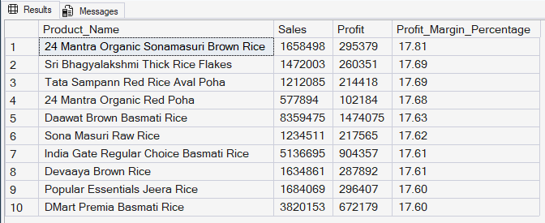

---

### <b> 📈 Q6. Category Contribution to Total Revenue
#### Find:
-	Total revenue for each Product Category
-	Percentage contribution of each category to overall sales

```MySQL
with Product_ as
(
select Product_Category,
SUM(Total_Selling_Price) as Product_Sum
from Rice_Sales
group by Product_Category
),
Total_ as
(
select
SUM(Product_Sum) as Total_Sum
from Product_
)
select p.Product_Category, p.Product_Sum as Product_Revenue, t.Total_Sum as Total_Revenue, 
CAST((p.Product_Sum * 100.0) / NULLIF(t.Total_Sum, 0) as decimal(10, 2))
as Percentage_Contribution
from Product_ p cross join Total_ t
order by Percentage_Contribution desc;
```
## 📷 Output

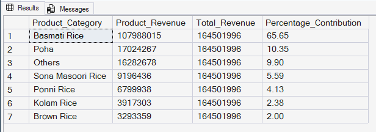

---

### <b> 📈 Q7. Detect Loss-Making Products
#### *Identify products where total profit is negative and show.*
-	Product Name
-	Location
-	Total Loss

```MySQL
select Product_Name, Location, sum(Profit) as Profit
from Rice_Sales
group by Product_Name, Location
having sum(Profit) < 0
order by Profit desc
```
## 📷 Output


---

### <b> 📈 Q8. Best Performing Brand by Each Location
#### *For each location, find the brand with the highest total profit using ROW_NUMBER ().*

```MySQL
With Brand_Profit as 
(
select Location, Rice_Brand,SUM(Profit) as Profit,
ROW_NUMBER() over(partition by Location order by sum(Profit) desc) as Brand_Rank
from Rice_Sales
group by Location, Rice_Brand
)
select Location, Rice_Brand, Profit, Brand_Rank
from Brand_Profit where Brand_Rank = 1;
```
## 📷 Output

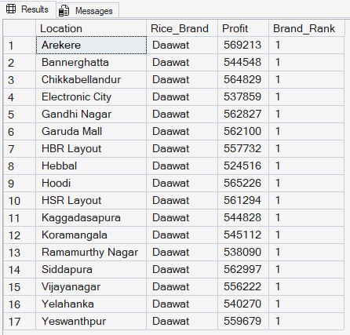

---

### <b> 📈 Q9. High vs Low Ticket Products
#### Classify products into:
-	•	High Value (Avg Selling Price > 300)
-	•	Medium Value (100–300)
-	•	Low Value (< 100)
#### Then count how many products fall into each group.

```MySQL
with Avg_Product as (
select Product_Name, AVG(Total_Selling_Price) as Average_Price
from Rice_Sales
group by Product_Name
)
select 
sum(case when Average_Price < 100 then 1 else 0 end) as Low_Value,
sum(case when Average_Price >= 100 and Average_Price <= 300 then 1 else 0 end) as Low_Value,
sum(case when Average_Price > 300 then 1 else 0 end) as High_Value
from Avg_Product;
```
## 📷 Output

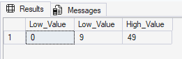

---

### <b> 📈 Q10. Repeat Sales Analysis
#### Find products that were sold in more than 10 different months and show:
-	Total units sold
-	Total revenue

```MySQL
with product_selection as
(
select Product_Name, Month_Name, Month,
SUM(Unit_Sold) as Unit,
SUM(Total_Selling_Price) as Sales
from Rice_Sales
group by Product_Name, Month_Name, Month
),
Quantity_sel as (
select Product_Name from product_selection
group by Product_Name having COUNT(*) > 10
)
select 
pr.Product_Name,
SUM(pr.Unit) as Unit_Sold,
SUM(pr.Sales) as Total_Revenue
from product_selection pr join Quantity_sel Q
on pr.Product_Name = q.Product_Name
group by pr.Product_Name
order by Total_Revenue desc;
```
## 📷 Output

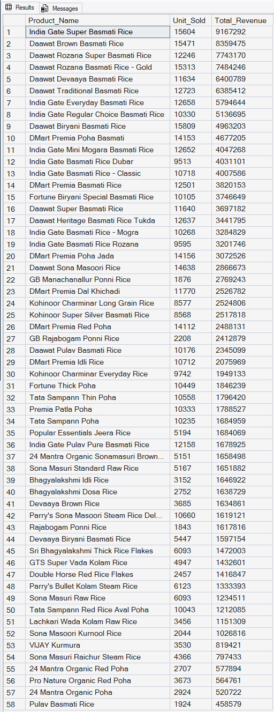

---

### <b> 📈 Q11. Cost vs Selling Price Variance
#### For each product, calculate:
-	Average Purchase Cost
-	Average Selling Price
-	Price Difference
#### Then show products where difference > ₹100.

```MySQL
with Product_Average as
(
select Product_Name, 
AVG(Total_Purchase_Cost) as Purchase_Cost,
AVG(Total_Selling_Price) as Selling_Price,
(AVG(Total_Selling_Price) - AVG(Total_Purchase_Cost)) as Price_Difference
from Rice_Sales
group by Product_Name
)
select Product_Name, Purchase_Cost, Selling_Price, Price_Difference
from Product_Average 
where Price_Difference > 100;
```
## 📷 Output

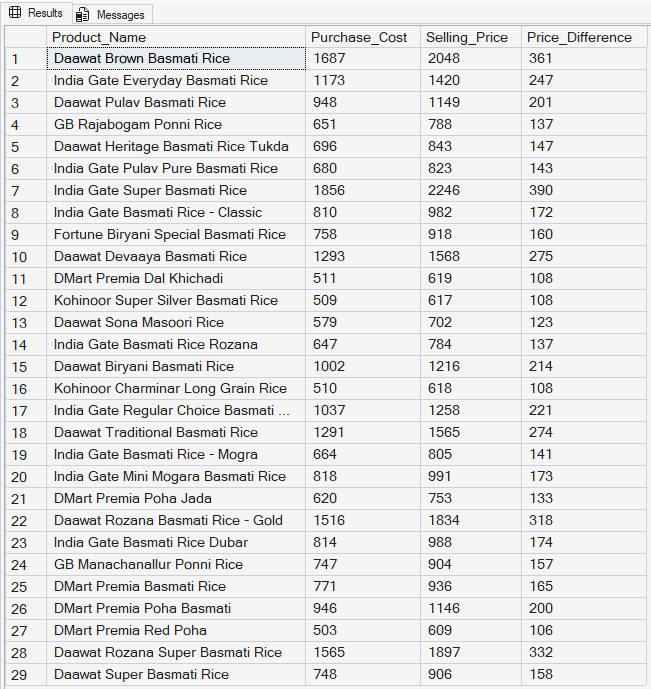

---

### <b> 📈 Q12. Year-over-Year (YoY) Profit Comparison
#### For every product category:
-	Show current year profit
-	Previous year profit
-	YoY profit difference

```MySQL
with Current_Profit as (
select YEAR, Product_Category, SUM(Profit) as Current_Year
from Rice_Sales 
group by YEAR, Product_Category
),
Previous_Profit as (
select YEAR, Product_Category, Current_Year,
LAG(Current_Year) Over(Partition by Product_Category Order by Product_Category, YEAR) as Previous_Year
from Current_Profit
)
select YEAR, Product_Category, Current_Year, Previous_Year,
case when Previous_Year IS NULL then NULL 
ELSE
Current_Year - Previous_Year
END
as YOY_Profit_Difference
from Previous_Profit;
```
## 📷 Output

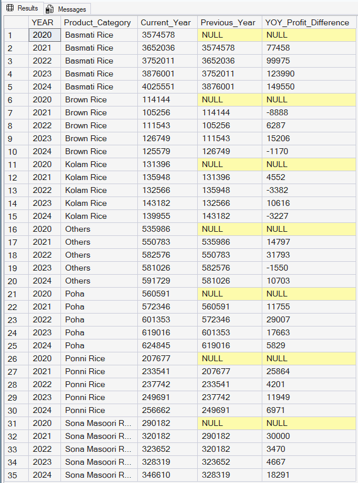

---

### <b> 📈 Q13. High Demand Low Profit Products
#### Find products where:
-	Total Units Sold is above average
-	But profit is below average
#### This shows operational inefficiency.

```MySQL
with SUM_Product as (
Select Product_Name, Product_ID, 
SUM(Unit_Sold) as Total_Unit_Sold,
SUM(Profit) as Total_Product_Profit
from Rice_Sales
group by Product_ID, Product_Name 
),
Average_Product as (
select
AVG(Total_Unit_Sold) as Average_Unit,
AVG(Total_Product_Profit) as Average_Profit
from SUM_Product
)
select Product_Name,
Total_Unit_Sold, Average_Unit,
Total_Product_Profit, Average_Profit
from SUM_Product cross join Average_Product
where Total_Unit_Sold > Average_Unit and Total_Product_Profit < Average_Profit
order by Product_Name;
```
## 📷 Output

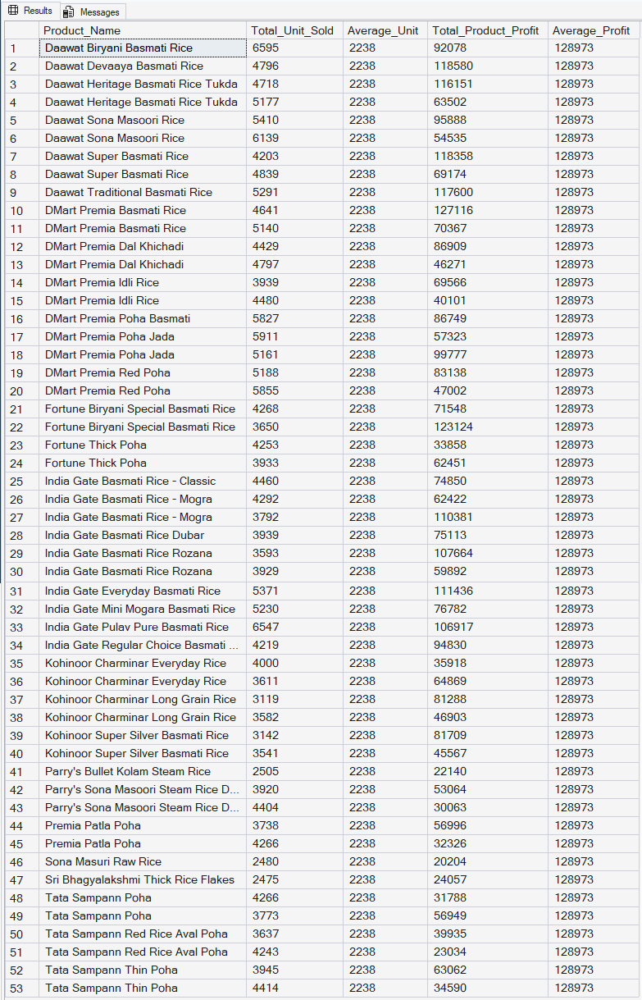
